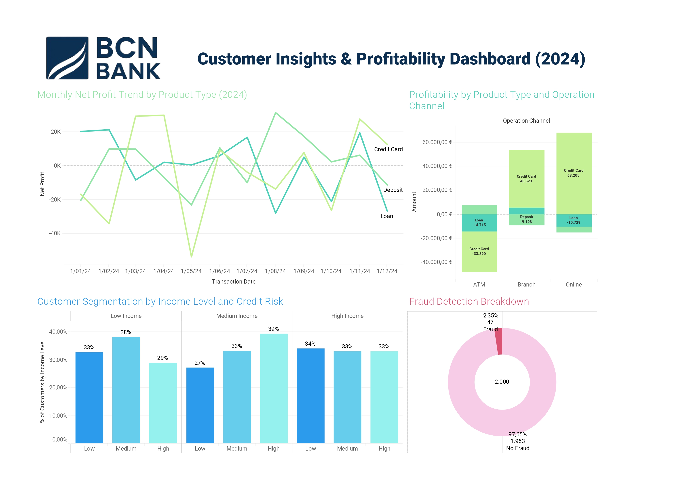

# 🏦 BCN Bank – Customer Insights & Profitability Dashboard (2024)

Este proyecto analiza más de 2.000 transacciones bancarias ficticias para descubrir insights clave sobre clientes, fraude y rentabilidad por producto y canal. Utiliza **SQL** para modelado de datos y **Tableau** para visualización.

🔗 **[Ver el dashboard en Tableau Public](https://public.tableau.com/app/profile/david.mart.nez.mart.n/viz/bcn_bank/BCNBANKCustomerInsightsProfitabilityDashboard2024?publish=yes)**  
📁 **[Ver el repositorio en GitHub](https://github.com/davidmartimar/bcn-bank-dashboard)**

---
## Dashboard Preview

---

## 🛠️ Tecnologías usadas

- **MySQL** – Diseño y carga de un modelo en estrella
- **Tableau** – Creación del dashboard interactivo
- **Python (opcional)** – Para generación sintética de datos

---

## 📊 Dashboards incluidos

1. **Tendencia mensual de beneficios**  
   Visualiza el beneficio neto mensual por tipo de producto durante todo 2024.

2. **Rentabilidad por tipo de producto y canal**  
   Compara ingresos y pérdidas entre canales (`ATM`, `Branch`, `Online`) y productos (`Loan`, `Credit Card`, `Deposit`).

3. **Segmentación de clientes**  
   Muestra la proporción de clientes según su nivel de ingresos y riesgo crediticio.

4. **Análisis de fraude**  
   Gráfico de anillo que muestra la proporción de transacciones fraudulentas.

---

## 📁 Estructura del repositorio

- `README.md` – Descripción general del proyecto
- `sql/`
  - `create_tables.sql` – Scripts de creación del modelo
  - `insert_data.sql` – Scripts de carga de datos (opcional)
- `data/`
  - `customer.csv`
  - `product.csv`
  - `datedim.csv`
  - `transactionfact.csv`
- `dashboard/`
  - `bcn_bank_dashboard.jpg` – Vista previa
  - `bcn_bank_dashboard.twbx` – Archivo Tableau
- `insights/`
  - `key_findings.md` – Resumen de conclusiones clave

---

## 💬 Conclusión

Este proyecto simula un entorno real de análisis bancario y visualización avanzada, siendo una excelente muestra de habilidades en **Data Analytics**. Puede servir como plantilla para proyectos similares en otras industrias o datasets reales.
